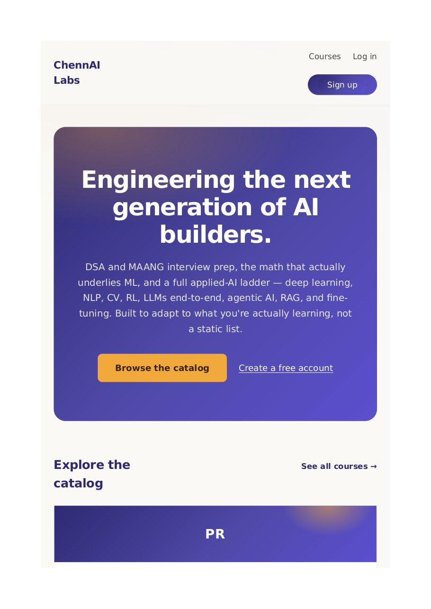
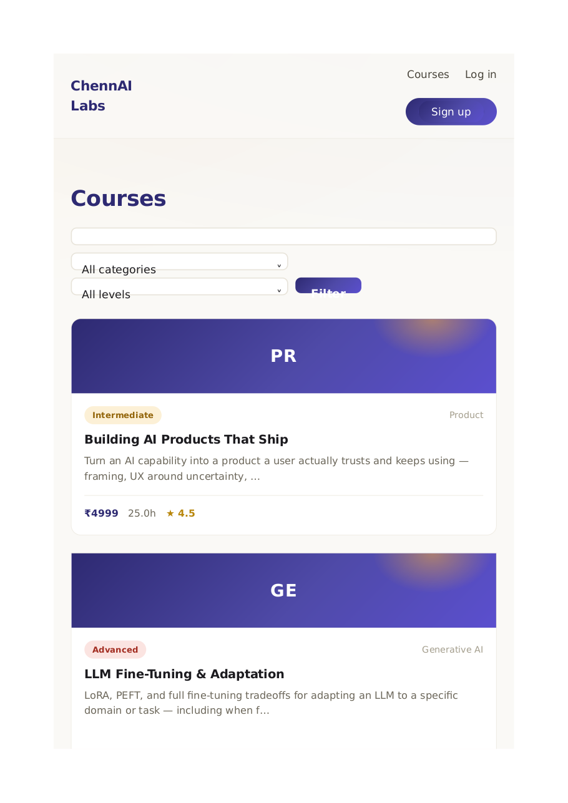
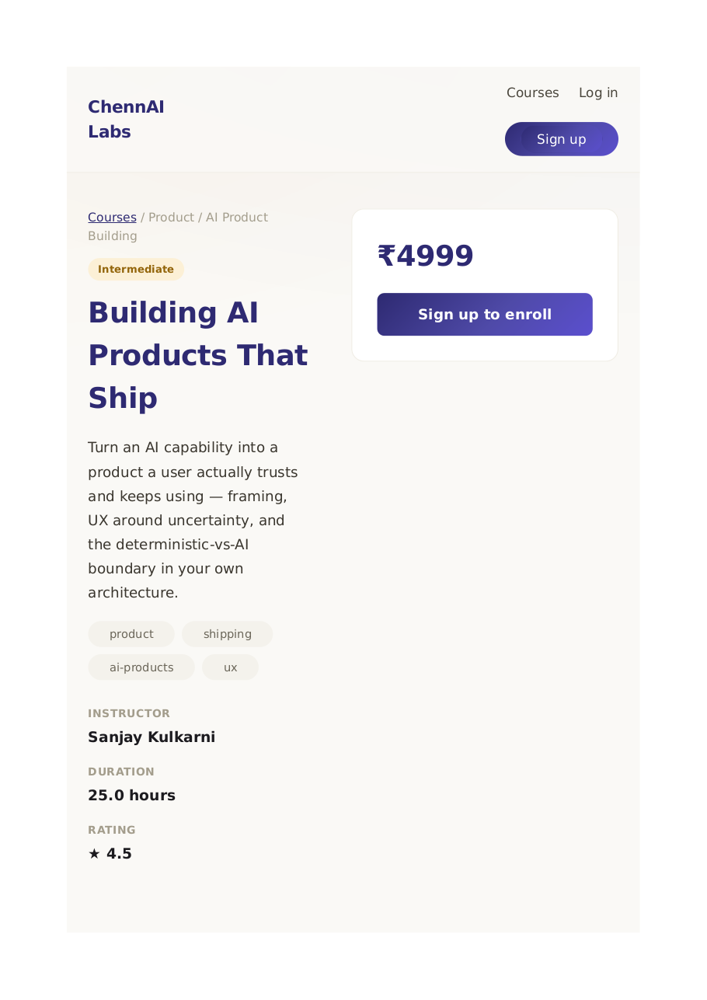
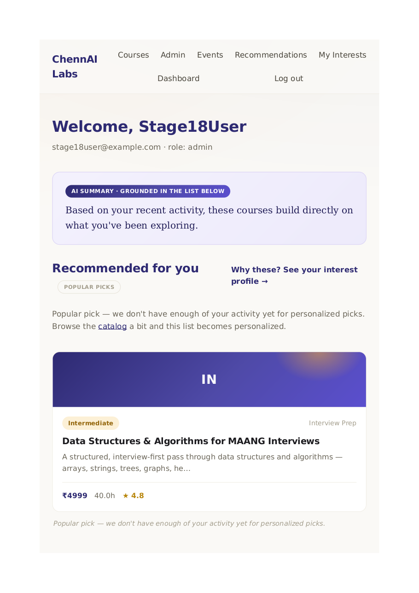
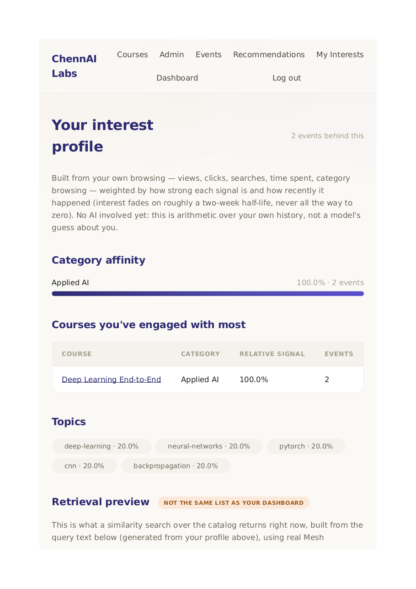
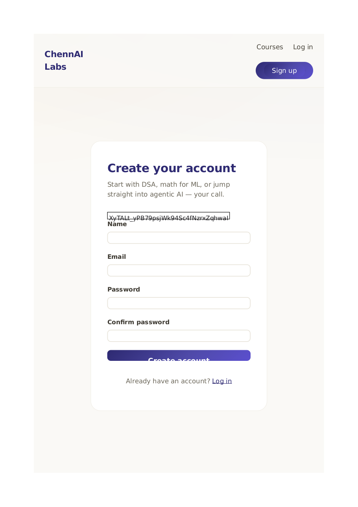
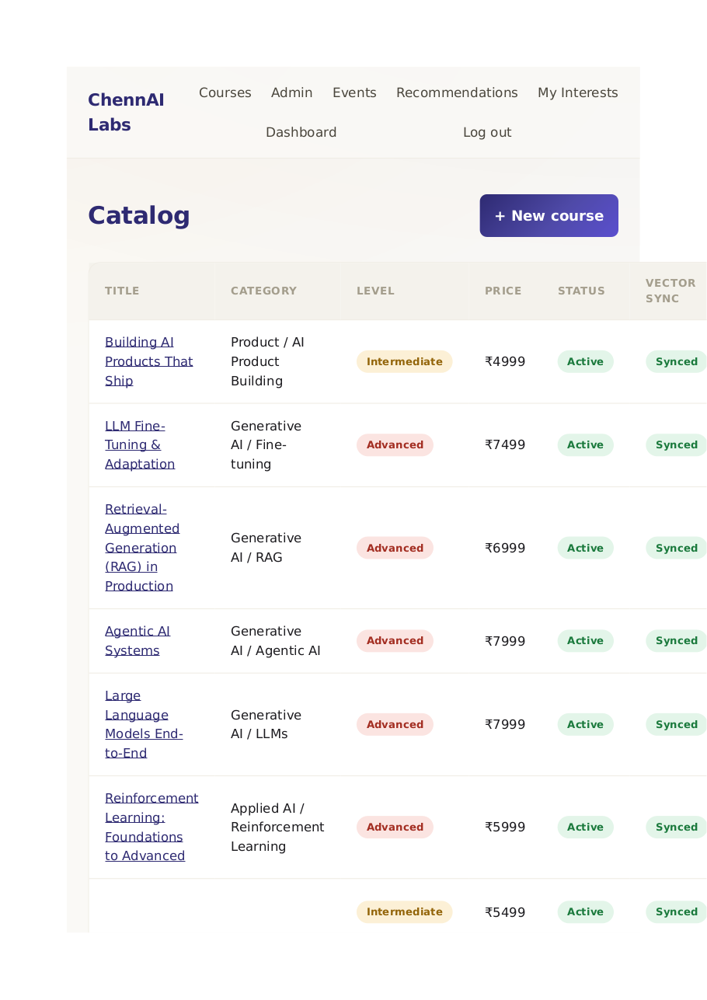
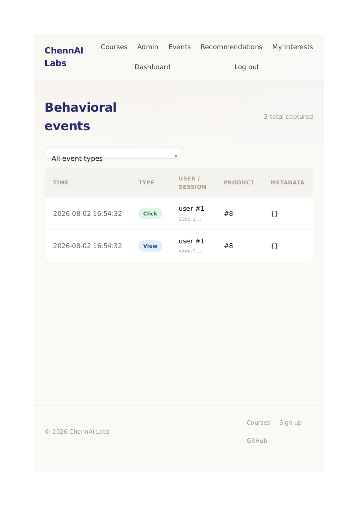
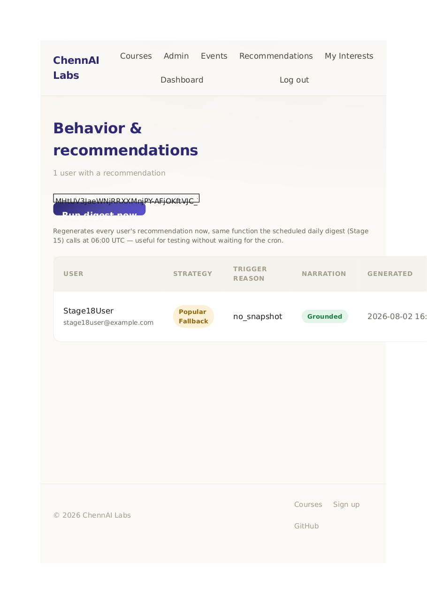
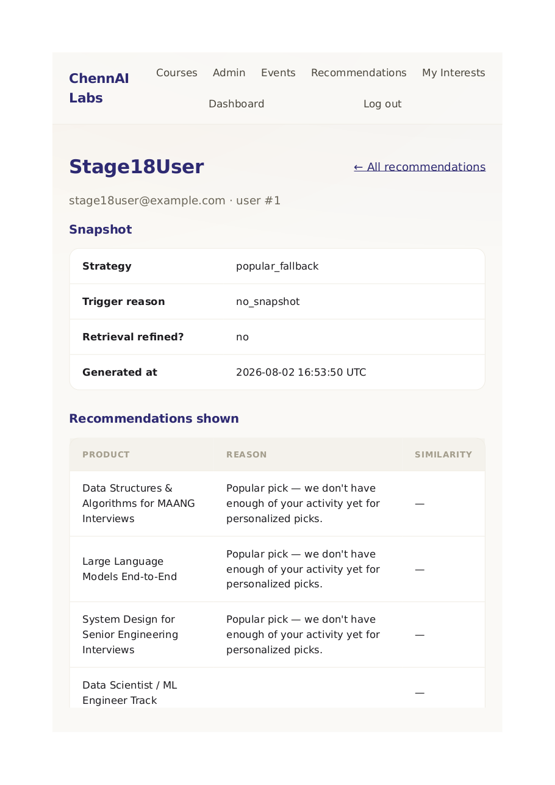

# ChennAI Labs

> Engineering the next generation of AI builders.

ChennAI Labs is a behavioral AI recommendation platform for a technical learning catalog — DSA/MAANG interview prep, math for ML, and the full applied-AI ladder (deep learning, NLP, CV, RL, LLMs, agentic AI, RAG, fine-tuning). It watches how a learner actually behaves — what they view, search, and linger on — builds a per-user interest profile that evolves over time, and uses retrieval-augmented generation to recommend the next best courses with a clear, honest, AI-written explanation grounded in real data.



## Table of contents

- [What it does](#what-it-does)
- [Key features](#key-features)
- [How it works](#how-it-works)
- [Tech stack](#tech-stack)
- [Getting started](#getting-started)
- [Using the app](#using-the-app)
- [Configuration](#configuration)
- [Testing](#testing)
- [Project structure](#project-structure)
- [Documentation](#documentation)
- [Deploying to production](#deploying-to-production)

## What it does

A learner browses the course catalog. Every view, search, click, and lingering visit is captured non-blockingly in the background and turned into a per-user interest profile — one that decays gracefully over time, so a three-month-old click doesn't count the same as this morning's. That profile drives a real semantic search against a vector database, which feeds a deterministic ranking pipeline (novelty filtering, category diversity, cold-start handling) — and only *after* that ranking is final does a language model write one short, grounded sentence explaining the picks, with every fact it cites checked against the real recommendation list before it's ever shown to anyone.

Recommendations are cached as durable database rows, not recomputed on every page load, and only regenerate when a deterministic rule decides something meaningful actually changed — the AI call happens when it's warranted, not on every request. A full admin console exposes the entire decision trail behind any user's current recommendation: which retrieval attempt fired, what the candidate pool looked like before filtering, and the model's raw, pre-validation output.

## Key features

- **Behavioral tracking that never blocks the page** — client-side capture of views, searches, clicks, category browsing, and dwell time, batched and delivered via `navigator.sendBeacon`.
- **A real, inspectable interest profile** — deterministic, explainable scoring with recency decay, viewable end to end at `/profile`.
- **Semantic retrieval** — a real embedding-based vector search over the catalog, not keyword matching.
- **A deterministic recommendation engine** — novelty exclusion, category diversity, and a sensible cold-start fallback, with zero AI involved in the ranking itself.
- **Grounded AI narration** — a short, personalized explanation generated by an LLM over the *already-finalized* list, with every citation validated against the real data before display. A hallucinated reference is rejected outright, never shown.
- **An agentic refinement loop** — retrieval quality is checked, and a weak result triggers one bounded, automatic query refinement and retry.
- **Smart caching** — recommendations are persisted and only regenerated when a clear trigger condition is met, keeping AI spend proportional to real behavior change, not page views.
- **A proactive daily digest** — a scheduled background job keeps every user's cached recommendation warm.
- **Full observability** — a complete, replayable trace (retrieval attempts, candidate pool, raw model output) behind every single recommendation, inspectable from the admin console.
- **Production-grade hardening** — rate limiting, security headers, secure cookies, and startup configuration validation.
- **A real admin console** — catalog CRUD with a live vector-sync status, a behavioral event debug view, and the full recommendation trace explorer described above.
- **207 automated tests** at 96% line coverage, plus a separate behavioral quality evaluation harness that scores the system against realistic user journeys — not just code correctness.

## How it works

```
  Learner activity                Interest profile              Retrieval + ranking
  ┌──────────────┐   captured    ┌──────────────────┐  drives  ┌────────────────────┐
  │ view / search │ ────────────▶│ per-user scores,  │ ───────▶ │ vector search  →    │
  │ click / dwell │  (non-       │ recency-weighted  │          │ novelty filter →    │
  └──────────────┘   blocking)   └──────────────────┘          │ diversity re-rank   │
                                                                  └─────────┬──────────┘
                                                                            │ final list
                                                                            ▼
  Cached & served                Grounded explanation           ┌────────────────────┐
  ┌──────────────────┐  serves  ┌──────────────────────┐ writes │ LLM narration over  │
  │ persisted snapshot│◀──────── │ citation-validated    │◀───── │ the finalized list  │
  │ (regenerate only  │  when   │ one-sentence summary  │        │ only — never ranks  │
  │  on real trigger) │  stale  └──────────────────────┘        └────────────────────┘
  └──────────────────┘
```

The pipeline is entirely deterministic up through ranking — an LLM is only ever asked to *explain* an already-decided list, never to decide it, and its output is fact-checked against that same list before a user sees it. See [How the recommendation engine works](docs/ENGINEERING_NOTES.md) for the full design rationale behind every piece of this, including the caching/trigger rules, the retrieval-refinement loop, and every live-verification result.

## Tech stack

| Layer | Choice |
|---|---|
| Backend | [FastAPI](https://fastapi.tiangolo.com/) |
| Frontend | Server-rendered Jinja2 templates + vanilla JS (no SPA framework) |
| Database | SQLite locally, PostgreSQL in production — same SQLAlchemy models, via Alembic migrations |
| Vector store | [Chroma](https://www.trychroma.com/), embedded |
| AI provider | Mesh API (embeddings + chat completions) — the only AI integration point in the codebase |
| Background jobs | [APScheduler](https://apscheduler.readthedocs.io/) (the daily digest) |
| Testing | pytest + pytest-cov, plus a standalone behavioral eval harness |

## Getting started

### Prerequisites

- Python 3.10+
- A Mesh API key (optional — see below; the app runs without one, with AI features gracefully degraded)

### 1. Clone and set up a virtual environment

```bash
git clone https://github.com/venkateshelangovan/ChennAI-Labs.git
cd ChennAI-Labs/chennai_labs
python -m venv .venv

source .venv/bin/activate        # macOS/Linux
.venv\Scripts\Activate.ps1       # Windows (PowerShell)
```

### 2. Install dependencies

```bash
pip install -r requirements.txt
```

### 3. Configure environment variables

```bash
cp .env.example .env
```

The defaults work out of the box for local development — SQLite, no Mesh key required. See [Configuration](#configuration) below for what each variable does.

### 4. Set up the database

```bash
alembic upgrade head
```

### 5. Load a starting catalog

```bash
python -m scripts.seed_products
```

Loads 16 realistic courses across the full catalog (DSA/interview prep, math for ML, and the applied-AI ladder). Safe to re-run — it skips courses that already exist.

### 6. Run the server

```bash
uvicorn app.main:app --reload
```

Visit **http://127.0.0.1:8000** — you should see the homepage with the featured catalog.

### 7. (Optional) Create an admin account

Admin accounts are never created through the public sign-up form, on purpose — they're provisioned out-of-band:

```bash
python -m scripts.create_admin admin@chennailabs.dev "Str0ng-Password!" "Admin Name"
```

Log in with those credentials to reach the admin console (`/admin/products`, `/admin/events`, `/admin/recommendations`).

That's it — the full application is running locally with no external dependencies required.

## Using the app

### As a learner

1. **Browse the catalog** at `/courses` — search, or filter by category and level.
2. **Open a few course pages.** Every view is captured automatically in the background.
3. **Create an account** at `/register`, or continue browsing anonymously — your activity is preserved either way and attached to your account the moment you sign up.
4. **Visit `/dashboard`** to see your personalized recommendations, complete with a short AI-written explanation of why they were picked.
5. **Visit `/profile`** to see exactly what the system has learned about you — category affinities, top engaged-with courses, recent searches, and a live "retrieval preview" showing the raw similarity search underneath your recommendations.

The more you browse, search, and click, the more your dashboard adapts — try viewing a few courses in one category, then check `/dashboard` again.

### As an administrator

| Page | What it's for |
|---|---|
| `/admin/products` | Full catalog CRUD, with a live vector-sync status per course and a one-click "Sync now" for anything out of date |
| `/admin/events` | A live feed of every captured behavioral event, filterable by type |
| `/admin/recommendations` | Every user's current recommendation, strategy, and trigger reason — with a "Run digest now" button to regenerate everyone's recommendation on demand |
| `/admin/recommendations/{user_id}` | The complete decision trace for one user's recommendation: every retrieval attempt, the full candidate pool with similarity scores, the model's raw pre-validation output, and any rejected citations |

### Screenshots

| | |
|---|---|
| **Catalog** — browse, search, filter |  |
| **Course detail** |  |
| **Dashboard** — grounded AI summary + ranked recommendations |  |
| **Interest profile + retrieval preview** |  |
| **Sign up** |  |
| **Admin: catalog management** |  |
| **Admin: behavioral event feed** |  |
| **Admin: recommendations overview** |  |
| **Admin: full recommendation trace** |  |

More in [`docs/screenshots/`](docs/screenshots/). A note on how these were produced: this environment has no path to a real headless browser, so each image is a genuine render of the actual running app's HTML/CSS — via WeasyPrint + `pdftocairo` rather than a browser screenshot tool. Full explanation in [`docs/ENGINEERING_NOTES.md`](docs/ENGINEERING_NOTES.md#documentation).

## Configuration

All variables live in `.env` (copy from `.env.example`); every default works for local development.

| Variable | Purpose | Default |
|---|---|---|
| `APP_ENV` | `development` or `production` — gates secure cookies, HSTS, and startup config warnings | `development` |
| `SESSION_SECRET` | Reserved for future use (sessions are opaque DB-backed tokens, not signed) | placeholder |
| `SESSION_TTL_DAYS` | How long a login session lasts | `7` |
| `DATABASE_URL` | SQLite locally, PostgreSQL in production | `sqlite:///./chennai_labs.db` |
| `VECTOR_DB_PATH` | Where the embedded Chroma vector store persists | `./.chroma` |
| `MESH_API_KEY` | Your Mesh API key — **leave blank to run without AI features** (see below) | *(blank)* |
| `MESH_BASE_URL` | Mesh API base URL | `https://api.meshapi.ai/v1` |
| `MESH_EMBEDDING_MODEL` / `MESH_CHAT_MODEL` | Model names for embeddings / chat | `mesh-embed-v1` / `mesh-chat-v1` |
| `DIGEST_ENABLED` | Turn the daily background recommendation refresh on/off | `true` |
| `DIGEST_HOUR_UTC` | What hour (UTC) the daily digest runs | `6` |

**Running without a Mesh API key works fine.** Authentication, the catalog, behavioral tracking, and the interest profile all function with no AI access at all — only the vector sync and AI-generated features gracefully fall back (recommendations use a deterministic popularity ranking instead of a personalized one).

## Testing

```bash
pytest
```

207 tests covering every layer of the application — authentication, the catalog, behavioral tracking, the interest profile, retrieval, the recommendation pipeline, grounding validation, caching, the digest, rate limiting, and the admin console.

```bash
pytest --cov=app --cov-report=term-missing   # coverage report (96% line coverage)
pytest -n 4                                   # parallel run (requires pytest-xdist)
```

**Behavioral quality evaluation** — a separate, non-pytest harness that runs the real recommendation pipeline against three realistic user journeys (a deepening-interest user, a beginner, and a mid-journey pivot) and scores category relevance, level-appropriateness, and pivot responsiveness:

```bash
python -m evals.run_evals
```

Writes a report to `evals/latest_report.md`. See [`docs/ENGINEERING_NOTES.md`](docs/ENGINEERING_NOTES.md#test-suite--eval-framework) for what each metric means and the one open finding from the latest run.

## Project structure

```
chennai_labs/
├── app/
│   ├── main.py                  # FastAPI app, middleware, exception handlers
│   ├── templating.py            # shared Jinja2Templates instance
│   ├── core/                    # config, logging, security, CSRF, rate limiting, scheduler
│   ├── db/                      # SQLAlchemy models + session management
│   ├── auth/                    # registration, login, sessions, role checks
│   ├── products/                # catalog CRUD, search/filter, dual-write orchestration
│   ├── admin/                   # admin console routes (products, events, recommendations)
│   ├── events/                  # behavioral event ingestion
│   ├── profile/                 # interest-profile aggregation
│   ├── recommendations/         # ranking, narration, caching, trigger, daily digest
│   ├── retrieval/               # embeddings, vector store, semantic query
│   ├── mesh/                    # the one module allowed to call an AI provider
│   ├── templates/                # Jinja2 templates
│   └── static/                  # CSS + the behavioral-tracking JS
├── alembic/                     # database migrations
├── scripts/                     # admin provisioning, catalog seeding, reindexing
├── evals/                       # behavioral quality evaluation harness
├── docs/                        # architecture doc, requirements mapping, screenshots, engineering notes
├── tests/                       # the automated test suite
├── requirements.txt
└── .env.example
```

## Documentation

- [`docs/ENGINEERING_NOTES.md`](docs/ENGINEERING_NOTES.md) — the full design rationale behind every subsystem: Mesh integration details, the grounding-validation logic, the recommendation ranking rules, the caching/trigger design, and the evidence from every live-verification pass.
- [`docs/ARCHITECTURE.md`](docs/ARCHITECTURE.md) — the original system design document: product concept, database and vector schema, and the demo user journeys used throughout development.
- [`docs/REQUIREMENTS_MAPPING.md`](docs/REQUIREMENTS_MAPPING.md) — every project requirement mapped to the file that implements it.
- [`docs/FINAL_AUDIT.md`](docs/FINAL_AUDIT.md) — the final requirement-by-requirement sign-off.

## Deploying to production

The app is built to move to PostgreSQL and a production environment without any code changes:

1. Set `DATABASE_URL` to a PostgreSQL connection string and run `alembic upgrade head` against it.
2. Set `APP_ENV=production` — this enables `Secure` cookies, HSTS, and startup checks that warn (not fail) on insecure defaults.
3. Set a real `MESH_API_KEY` to enable AI-powered recommendations and narration.
4. Generate a real `SESSION_SECRET` (`python -c "import secrets; print(secrets.token_hex(32))"`) — reserved for future use, but good practice to set regardless.
5. Set `VECTOR_DB_PATH` to a persistent volume path if deploying anywhere the filesystem isn't durable across restarts.

Rate limiting is in-process by design (see [`docs/ENGINEERING_NOTES.md`](docs/ENGINEERING_NOTES.md#production-hardening)) — fine for a single instance, worth revisiting with a shared store if scaling to multiple worker processes or replicas.
