# SmartReco 2026 — Stage 0: Product Vision & Architecture

> **Note (Stage 19):** this is the original Stage 0 planning document, checked
> into the repo unedited as a historical record — every architectural
> decision below (dual-write, LangGraph-vs-plain-pipeline, Redis-vs-DB-cache,
> Chroma-vs-managed-vector-DB, etc.) is exactly what shipped, stage by stage,
> through Stage 18. It reads as "DRAFT for approval" below because that's
> what it was the day it was written — before Stage 1 existed. See the main
> [README](../README.md) for the as-built system, and
> [`REQUIREMENTS_MAPPING.md`](./REQUIREMENTS_MAPPING.md) for where each
> requirement below actually landed in the code.

**Status: DRAFT for approval. No code has been written yet.**

---

## 1. Product Concept

We are building a behavioral AI recommendation platform for online learning products (courses). The product observes what a learner does — what they view, search, and linger on — builds an evolving picture of their interests, and uses retrieval-augmented generation to surface the next best courses with a clear, honest explanation of why.

The design goal is that this reads as a real product a learner would trust, not a demo built to check hackathon boxes. Concretely that means: the recommendation is never a static "people like you also viewed" widget, the reasoning shown to the user is always traceable to real events they generated, and the admin side feels like an internal tool a real content team would use to manage a catalog.

### Proposed name & branding

**Name: ChennAI Labs**
Tagline: *"Engineering the next generation of AI builders."*

Rationale: the catalog isn't a generic course marketplace — it's DSA/MAANG interview prep, math for ML, and a full applied-AI ladder (ML, DL, NLP, CV, RL, LLMs end-to-end, agentic AI, RAG, fine-tuning, building products). "Labs" signals hands-on building rather than passive video-watching, which matches content like "building products" and "agentic AI/RAG/fine-tuning" courses that are inherently project-based. "ChennAI" is a deliberate, ownable pun rather than a generic ed-tech word — it reads as a place/identity (a lab you belong to) rather than a feature description, which is what makes it feel like a real product rather than a hackathon placeholder. This is a proposal, not a commitment — easy to swap later since it only touches templates/copy, not architecture.

**Design language:**

| Element | Choice | Why |
|---|---|---|
| Primary color | Deep indigo (#2E2A72) | Calm, premium, associated with focus/learning rather than e-commerce urgency |
| Accent color | Warm amber (#F2A93B) | Used sparingly for CTAs and "recommended" badges — draws the eye without feeling salesy |
| Neutral scale | Warm gray (#F7F6F3 → #1A1A1A) | Avoids the cold blue-gray of generic admin dashboards |
| Typography | Inter (UI) / Source Serif for long-form narrative text | Inter is a clean, production-grade UI font; a serif for the AI narrative visually distinguishes "generated explanation" from "interface chrome" |
| Layout | Card-based catalog, generous whitespace, single-column focus on product detail pages | Course marketplaces (Coursera, Maven) use this pattern because it scans well and photographs well for screenshots |

---

## 2. User Journeys

**Journey 1 — New learner discovers the platform.** Visitor lands on homepage → browses catalog or searches → views a few product detail pages → registers → behavior already captured pre-registration is attached to their new account (session-to-user reconciliation) → after enough signal accumulates, sees a personalized recommendation panel on their dashboard/homepage instead of a generic "featured" list.

**Journey 2 — Returning learner with an evolving interest.** Learner logs in, browses a new topic area for a few sessions → their interest profile shifts → next time recommendations refresh (not on every click — see Section 12), the narrative and product set visibly reflect the new direction, with an explanation like "Since you've been exploring X, here's a natural next step."

**Journey 3 — Admin manages the catalog.** Admin logs in with an admin role → sees a catalog table, not just a public grid → creates/edits/archives a product → the change is written to Postgres and, in the background, propagated to the vector index → admin can see a sync status per product and manually retry if the vector write failed → admin can also open a "behavior & recommendations" view for a given user or product for support/debugging purposes.

---

## 3. Functional Requirements

| ID | Requirement |
|---|---|
| FR1 | Users can register, log in, and log out; sessions are secure and expire |
| FR2 | Two roles exist: `user` and `admin`, enforced on every protected route |
| FR3 | Users can browse, search, and filter the product catalog |
| FR4 | Product detail pages render full metadata |
| FR5 | Admins can create, edit, archive/delete products through a dedicated UI |
| FR6 | Every product write is reflected in both the relational DB and the vector index, with visible sync status |
| FR7 | The frontend captures view, search, click, and time-spent events without blocking page interaction |
| FR8 | Events are persisted with enough structure to reconstruct "what did this user do, when, on what" |
| FR9 | The system derives a per-user interest profile from stored events, deterministically |
| FR10 | The system retrieves real candidate products via vector similarity search grounded in that profile |
| FR11 | An LLM (via Mesh only) generates a personalized narrative and selects/orders products strictly from the retrieved candidate set |
| FR12 | Any LLM-referenced product ID not in the candidate set is rejected before display or storage |
| FR13 | Recommendations are persisted with enough metadata to audit why they were generated |
| FR14 | Recommendations refresh based on meaningful behavioral triggers, not on every event |
| FR15 | Users can see *why* they're seeing a recommendation, in plain language grounded in their real activity |
| FR16 | Admins can inspect events, profiles, retrieval, and generation for a given recommendation (observability) |

## 4. Non-Functional Requirements

| ID | Requirement |
|---|---|
| NFR1 | No page load should block on analytics or AI calls |
| NFR2 | LLM calls are minimized and justified — never per-click |
| NFR3 | All secrets (Mesh key, DB credentials) come from environment variables, never committed |
| NFR4 | Passwords are hashed (bcrypt/argon2), never stored or logged in plaintext |
| NFR5 | The system degrades gracefully when Mesh, the vector store, or embeddings fail — it never crashes the page |
| NFR6 | The codebase is organized so a single feature (e.g. recommendations) lives in one place, not scattered |
| NFR7 | Every stage ships with tests covering its critical-path logic |
| NFR8 | The system is horizontally simple to reason about now, with an explicit, documented path to scale later (SQLite→Postgres, sync dual-write→outbox, etc.) |

---

## 5. System Architecture

ChennAI Labs is a single FastAPI monolith serving server-rendered Jinja2 pages, backed by a relational database (source of truth) and an embedded vector store (semantic index derived from that source of truth). All AI calls — embeddings and generation — go through one centralized client pointed at Mesh.

```mermaid
flowchart TB
    subgraph Browser
        UI[Jinja2 Pages + Vanilla JS]
        Tracker[Behavioral Tracker\n(batched, sendBeacon)]
    end

    subgraph FastAPI Monolith
        Routes[Routes / Controllers]
        AuthSvc[Auth Service]
        ProductSvc[Product Service]
        EventSvc[Event Ingestion Service]
        ProfileSvc[Interest Profile Builder\n(deterministic)]
        TriggerSvc[Trigger Evaluator\n(deterministic)]
        RecoSvc[Recommendation Orchestrator]
        AIClient[Mesh AI Client\n(embeddings + generation)]
        Validator[Grounding Validator\n(deterministic)]
    end

    DB[(PostgreSQL / SQLite\nusers, products, events,\nrecommendations)]
    VDB[(Chroma\nproduct embeddings)]
    Mesh[[Mesh API\napi.meshapi.ai/v1]]

    UI -->|HTTP requests| Routes
    Tracker -->|batched POST /events| Routes
    Routes --> AuthSvc --> DB
    Routes --> ProductSvc --> DB
    ProductSvc -->|dual write| AIClient
    AIClient -->|embed| Mesh
    ProductSvc --> VDB
    Routes --> EventSvc --> DB
    EventSvc --> ProfileSvc --> DB
    RecoSvc --> TriggerSvc --> DB
    TriggerSvc -->|if triggered| RecoSvc
    RecoSvc -->|semantic query| VDB
    RecoSvc --> AIClient -->|generate| Mesh
    RecoSvc --> Validator --> DB
    RecoSvc --> Routes
```

Everything downstream of "the LLM is asked to reason" is treated as untrusted output until the Validator checks it against real database state. This is the core discipline of the whole system: **the database is the source of truth, the LLM is responsible only for interpretation and language.**

---

## 6. Component Architecture

Rather than layering `controller → service → repository → DTO` everywhere (which is overkill for a system this size), each feature area gets one **service module** that owns its logic and talks to the DB directly through the ORM, plus a thin **routes module** that handles HTTP concerns (auth checks, request parsing, template rendering). This keeps the number of files proportional to the number of real concerns.

| Module | Owns | Talks to |
|---|---|---|
| `auth` | registration, login, session issuance, password hashing, role checks | `users`, `sessions` tables |
| `products` | CRUD, catalog browse/search, dual-write orchestration | `products` table, vector store |
| `events` | validating and persisting behavioral events | `user_events` table |
| `profiles` | deterministic aggregation of events into an interest profile | `user_events`, cached `user_interest_profile` |
| `retrieval` | embedding queries, vector search, candidate filtering | Mesh (embeddings), vector store |
| `recommendations` | orchestrates trigger → retrieval → generation → validation → storage | `profiles`, `retrieval`, `ai`, DB |
| `ai` | one client wrapping the Mesh-compatible OpenAI SDK; nothing else calls Mesh directly | Mesh API only |
| `admin` | catalog management UI, sync status, event/recommendation inspection | all of the above, read-mostly |

---

## 7. Database Design

Postgres is the target production database; SQLite is used for local development because it requires no setup and both are accessed through the same SQLAlchemy models, so the migration is a connection-string change plus running Alembic migrations against Postgres — no query rewriting, since we avoid DB-specific SQL features (no raw JSON operators, no Postgres-only types beyond what SQLAlchemy abstracts). This is called out explicitly rather than left implicit, since "SQLite now, Postgres later" is only safe if the code never leans on SQLite- or Postgres-specific behavior.

```mermaid
erDiagram
    USERS ||--o{ SESSIONS : has
    USERS ||--o{ USER_EVENTS : generates
    USERS ||--o{ RECOMMENDATIONS : receives
    USERS ||--o| USER_INTEREST_PROFILE : has
    PRODUCTS ||--o{ USER_EVENTS : "referenced by"
    RECOMMENDATIONS ||--o{ RECOMMENDATION_ITEMS : contains
    PRODUCTS ||--o{ RECOMMENDATION_ITEMS : "referenced by"

    USERS {
        int id PK
        string email UK
        string password_hash
        string role
        string display_name
        datetime created_at
        datetime updated_at
    }
    SESSIONS {
        string token PK
        int user_id FK
        datetime expires_at
        datetime created_at
    }
    PRODUCTS {
        int id PK
        string slug UK
        string title
        text description
        string category
        string subcategory
        numeric price
        string level
        json tags
        string instructor
        int duration_minutes
        float rating
        string image_url
        string status
        string content_hash
        string vector_sync_status
        datetime created_at
        datetime updated_at
    }
    USER_EVENTS {
        bigint id PK
        int user_id FK
        string session_id
        string event_type
        int product_id FK
        json metadata
        datetime created_at
    }
    USER_INTEREST_PROFILE {
        int user_id PK_FK
        json profile
        int events_since_last_recommendation
        datetime last_computed_at
    }
    RECOMMENDATIONS {
        int id PK
        int user_id FK
        text narrative
        string trigger
        string model
        text retrieval_query
        string status
        datetime created_at
    }
    RECOMMENDATION_ITEMS {
        int id PK
        int recommendation_id FK
        int product_id FK
        int rank
        float similarity_score
        text reason_snippet
    }
```

**Why each table exists, and the constraints that matter:**

`users` is the identity table. `email` is unique and indexed since it's the login key; `role` is a plain string (`user`/`admin`) rather than a separate roles table because we have exactly two roles and no plan for more — a join table would be premature generality.

`sessions` backs server-side session auth: on login we issue a random opaque token, store it with an expiry, and set it as an httponly cookie. This is simpler and easier to revoke than a JWT (revocation just means deleting the row), which matters more than JWT's statelessness at this scale.

`products` is the catalog and the source of truth for the vector store. `slug` is unique for clean URLs. `status` (`active`/`archived`) drives soft deletes — we never hard-delete a product a recommendation might reference historically. `content_hash` is a hash of the fields that get embedded (title, description, category, tags, level); it lets us skip re-embedding on updates to unrelated fields (e.g. price), which matters for the "don't call AI unnecessarily" requirement. `vector_sync_status` (`pending`/`synced`/`failed`) is the mechanism the dual-write design (Section 9) uses to detect and repair drift.

`user_events` is append-only and the rawest layer of truth about behavior. `product_id` is nullable because a `search` event has no associated product. `metadata` (JSON) holds event-specific detail — a search query string, a scroll depth, a duration in ms — without forcing every event type into the same rigid columns. Indexed on `(user_id, created_at)` for the profile builder's per-user time-window queries, and on `product_id` for admin/debug lookups.

`user_interest_profile` is a **cache**, not a source of truth — it's fully derivable by replaying `user_events`, and we say so explicitly so nobody is tempted to treat it as authoritative. It exists purely so we don't recompute an aggregate over the full event history on every page load; `events_since_last_recommendation` is the counter the trigger evaluator reads to decide whether to refresh (Section 12).

`recommendations` and `recommendation_items` are the audit trail: one row per generation event, with the narrative, what triggered it, which model produced it, and the retrieval query used, plus one child row per recommended product with its rank and similarity score so we can answer "why was product X ranked #2" after the fact. `status` (`active`/`superseded`) lets us keep history without deleting old recommendations — new ones supersede old ones rather than overwriting them, which is what makes "recommendation history" (a stated requirement) possible at all.

Deletion behavior throughout: users and products are soft-deleted (`status`/`role` flags), never hard-deleted, because `user_events` and `recommendation_items` hold foreign keys into them and we want history to remain queryable. Only truly disposable rows (sessions on logout, stale password reset tokens if we add them later) get hard-deleted.

---

## 8. Vector Database Design

**Choice: Chroma, running embedded (in-process, persisted to a local directory) rather than as a separate service.**

| Option | Verdict | Why |
|---|---|---|
| **Chroma (embedded)** | **Chosen** | Zero extra infrastructure — no service to run, deploy, or keep alive; persists to disk; supports metadata filtering (category, level, status) alongside vector search, which we need; trivially swappable later |
| Qdrant | Rejected for now | Requires running a separate service (Docker container) even in local dev — real production advantage (better scaling, richer filtering, HTTP API) that we don't need yet |
| Pinecone | Rejected for now | Managed/hosted, needs its own API key and network calls for every query, and has a cost — disproportionate for a catalog of a few hundred products |
| FAISS | Rejected | No native metadata filtering or persistence story out of the box — we'd be rebuilding what Chroma already gives us |

The interface we write (`retrieval/vector_store.py`) is a thin wrapper (`upsert`, `query`, `delete`) so migrating to Qdrant later — e.g. if we deploy somewhere with an ephemeral filesystem — means swapping the implementation behind that interface, not rewriting the recommendation pipeline.

**What gets embedded, and why:** not the raw `description` field alone. We construct a single normalized text block per product:

```
Title: {title}
Category: {category} > {subcategory}
Level: {level}
Tags: {comma-joined tags}
Summary: {first ~300 chars of description}
```

Structuring it this way (rather than dumping the full free-text description) means the embedding weights the fields that actually distinguish products for retrieval purposes — category, level, and tags carry more discriminative signal than marketing prose, and truncating the description keeps noise down without losing the gist.

**Embedding model & routing:** embeddings are generated through the same centralized Mesh client used for generation — `POST {MESH_BASE_URL}/embeddings` via the OpenAI-compatible SDK, model TBD against whatever embedding model Mesh exposes (confirmed in Stage 9 when we integrate Mesh directly and can inspect what's actually available). This satisfies the requirement that embeddings, being an AI call, also route through Mesh rather than a direct provider SDK.

**Vector ID:** the product's primary key (as a string), so `upsert(id=product.id, ...)` is naturally idempotent — re-embedding and re-upserting a product is always safe to retry.

**Metadata stored alongside each vector:** `product_id`, `category`, `subcategory`, `level`, `status`, `price`. This lets retrieval combine semantic similarity with hard filters (e.g. "only `status=active`") in one query instead of over-fetching and filtering in Python.

**Update behavior:** on product update, we recompute `content_hash` over the embed-relevant fields; if unchanged (e.g. only the price changed), we skip re-embedding entirely — this is one of the concrete "what does NOT cause an AI call" answers the challenge asks for. If changed, we re-embed and upsert (overwrite) at the same vector ID.

**Delete behavior:** on archive (soft delete in SQL), we delete the vector from the index outright rather than keeping it filtered by metadata — this keeps the index lean and means a bug in a metadata filter can never accidentally surface an archived product, which is a stronger guarantee than filtering alone.

---

## 9. Dual-Write Strategy (SQL ↔ Vector)

This gets its own section because the challenge treats it as critical, and it's the one place in the system where two storage systems must agree without a shared transaction.

**Chosen approach for v1: synchronous dual-write with a status flag and a reconciliation sweep.** On create/update, we write to Postgres first (inside a normal transaction) and commit — the SQL write is authoritative and always succeeds or the whole operation fails, exactly like any CRUD operation. Only after that commit do we attempt the vector upsert, in the same request.

- **SQL succeeds, vector write fails:** we catch the exception, set `products.vector_sync_status = 'failed'`, log the error with the product ID, and return success to the admin — the product exists and is manageable, it's just temporarily invisible to retrieval (excluded from candidate generation until synced, so we never recommend something the vector index doesn't actually have a fresh embedding for). The admin UI surfaces a "N products need sync" indicator with a manual retry action.
- **Vector write succeeds, SQL fails:** structurally can't happen in the order we chose — SQL is attempted first and is the gate; if SQL fails, we never attempt the vector write at all.
- **Retries:** the upsert is idempotent (vector ID = product ID), so retrying is always safe — no risk of duplicate or drifting entries. A lightweight reconciliation job (run on admin dashboard load, or on a schedule once we have one — Stage 15) queries `WHERE vector_sync_status != 'synced'` and retries each.
- **Detection of drift beyond flagged failures:** periodically compare the set of active product IDs in SQL against the set of IDs in the vector store; anything present in one and not the other is flagged in the admin view. This catches cases outside the normal write path (e.g. manual data fixes).

**Why not an outbox pattern for v1:** an outbox (write an "intent" row in the same SQL transaction, relay it asynchronously) is the right answer once writes are frequent, must never be user-visibly delayed, or span multiple services. At this stage, admin catalog writes are low-frequency and synchronous-with-a-status-flag is strictly simpler while still being correct — the product is never in a state where SQL and vector silently disagree without it being visible and repairable. The explicit evolution path, if catalog write volume or vector store reliability ever justified it, is: add an `outbox_events` table, write to it in the same transaction as the product write, and have a background worker relay to the vector store and mark events processed — decoupling the admin's request latency from vector store availability entirely.

---

## 10. Behavioral Event Architecture

| Event type | Fires when | Key metadata |
|---|---|---|
| `view` | user opens a product detail page | `product_id`, referrer page |
| `search` | user submits a search query | query string, result count |
| `click` | user clicks a product card from a listing/search/recommendation | `product_id`, source surface (catalog/search/recommendation) |
| `category_view` | user filters/browses by category | category, subcategory |
| `time_spent` | user leaves or is idle on a product detail page | `product_id`, duration_ms |

We deliberately do not track mouse movement, keystrokes, or anything beyond what's needed to infer topical interest — no unnecessary personal data, per the stated principle. Every event is tied to a `user_id` (events before login are tied to a `session_id` and reconciled to the user at login/registration) and a `created_at` timestamp; nothing here is sensitive personal data, it's product interaction data.

### Non-blocking capture (frontend)

```
user action (view/search/click/dwell)
  → pushed into an in-memory JS event queue
  → queue flushes when: batch size reached (e.g. 10 events) OR 5s elapsed OR page is being unlinked
  → flush sends one batched POST /api/events (fetch, fire-and-forget)
  → on page unload specifically, uses navigator.sendBeacon so the browser guarantees delivery attempt without blocking navigation
  → backend validates + persists in one transaction
  → no response is awaited or required by the UI — a failed batch is dropped and logged client-side, never retried indefinitely (bounded retry, then drop)
```

The page is never waiting on this pipeline for anything — no spinner, no blocked click, no dependency between "did tracking succeed" and "did the user's action complete." If the events endpoint is down, the user notices nothing.

---

## 11. Recommendation Lifecycle

```mermaid
flowchart LR
    A[user_events] -->|deterministic aggregation\n+ recency weighting| B[Interest Profile]
    B -->|deterministic threshold check| C{Enough new\nsignal?}
    C -->|no| Z[Serve existing\nrecommendation, unchanged]
    C -->|yes| D[Build retrieval query\nfrom profile]
    D -->|embed via Mesh| E[Vector search\nin Chroma]
    E --> F[Candidate products\n+ similarity scores]
    F -->|filter: active status,\nexclude recently shown| G[Filtered candidates]
    G -->|Mesh: narrative +\nproduct selection| H[LLM output\nJSON: narrative + product IDs]
    H -->|check every ID\nagainst candidate set| I{All IDs valid?}
    I -->|no| J[Reject invalid IDs;\nfall back to top-K\ncandidates, no narrative]
    I -->|yes| K[Store recommendation\n+ recommendation_items]
    J --> K
    K --> L[Display to user\nwith reasoning]
```



The interest profile step and the trigger check are both fully deterministic — no AI call happens until we've already decided, from stored data alone, that a refresh is warranted. That boundary (Section 12) is what keeps AI usage proportional to actual behavior rather than to raw event volume.

---

## 12. Agent Workflow & the Deterministic/Probabilistic Boundary

The challenge explicitly warns against calling something an "agent" just because it calls an LLM. Here's the boundary we're enforcing:

**Deterministic (plain Python, fully testable without touching Mesh):**
- Event aggregation into the interest profile (frequency, recency weighting, category counts)
- The trigger decision (has enough new signal accumulated to justify a refresh?)
- Vector search execution and candidate filtering (status, dedup, exclude-recently-shown)
- Grounding validation (are the LLM's referenced product IDs actually in the candidate set?)
- Recommendation storage

**Probabilistic (the one Mesh call in the pipeline):**
- Interpreting *what the profile means* well enough to write a natural retrieval query
- Writing the persuasive, grounded narrative
- Choosing which subset/order of the *already-retrieved* candidates best fits the narrative (never inventing new ones)

For Stages 8–10, this is implemented as a straightforward Python function pipeline (profile → trigger → retrieve → generate → validate → store) — no LangGraph yet, because a linear pipeline with one conditional branch doesn't need graph machinery to be observable or correct. **LangGraph becomes worth adopting at Stage 11 specifically for the retrieval-quality-refinement loop** ("if retrieved candidates look weak, refine the query and retry") — that's a genuinely cyclic, stateful decision that a graph expresses more clearly than nested loops, and it comes with built-in state tracing that helps the observability requirement. We'll make that call explicitly at Stage 11 with the linear version already working as the fallback, rather than committing to it now.

```mermaid
flowchart TD
    START([Trigger fires]) --> LB[Load recent behavior]
    LB --> AB[Analyze behavior → profile]
    AB --> SIG{Sufficient signal?}
    SIG -->|no| END1([End — no change]))
    SIG -->|yes| BUILD[Build interest representation]
    BUILD --> RET[Retrieve candidates]
    RET --> QUAL{Retrieval quality\nacceptable?}
    QUAL -->|weak| REFINE[Refine query] --> RET
    QUAL -->|ok| RANK[Rank candidates]
    RANK --> GEN[Generate narrative\n+ selection via Mesh]
    GEN --> VAL{Grounded?}
    VAL -->|no| FALLBACK[Deterministic fallback\n— top-K, no narrative]
    VAL -->|yes| STORE[Store recommendation]
    FALLBACK --> STORE
    STORE --> END2([End])
```

---

## 13. Mesh API Architecture

One module, `ai/mesh_client.py`, is the only place in the codebase that imports the Mesh SDK or knows the base URL. Everything else calls functions like `get_embedding(text)` or `generate_recommendation(profile, candidates)` and never touches the SDK directly — this is what "never scatter Mesh calls throughout the application" means concretely, and it's what makes it possible to mock Mesh entirely in tests (Section 17).

```python
client = OpenAI(
    base_url="https://api.meshapi.ai/v1",
    api_key=os.environ["MESH_API_KEY"],  # never hardcoded, never logged
)
```

The client wrapper owns: model selection (configurable via env, not hardcoded per call site), request timeout, bounded retry with backoff on transient failures, structured logging of every call (latency, token usage if Mesh returns it, success/failure), and translating Mesh errors into a typed exception the recommendation pipeline can catch and fall back from gracefully (Section 11's `FALLBACK` node). Generation calls request structured JSON output (narrative + list of product IDs with a schema) rather than free text we'd have to parse loosely — this is finalized once we confirm exactly what structured-output support Mesh's endpoint exposes, at Stage 9.

---

## 14. AI-Call Strategy — What Triggers a Call, What Doesn't

| Action | Causes an AI call? |
|---|---|
| User views a product | No — just an event write |
| User searches | No — just an event write |
| User clicks a recommended product | No |
| Interest profile recomputation | No — pure aggregation over stored events |
| Trigger evaluator runs | No — pure threshold check |
| Admin creates/updates a product (embed-relevant fields changed) | **Yes** — one embedding call |
| Admin updates a product (only price/status changed) | No — `content_hash` unchanged, embedding skipped |
| Recommendation trigger fires (enough new signal + TTL elapsed, or manual refresh) | **Yes** — one embedding call (query) + one generation call |
| User revisits their dashboard before the recommendation is stale | No — cached recommendation served as-is |

**Trigger conditions for a refresh (finalized in Stage 12, previewed here):** a recommendation regenerates when (a) the user has none yet, or (b) the existing one has passed its TTL (e.g. 24h) *and* at least N meaningful events (e.g. 5, or any `search` event, which is a strong intent signal) have accumulated since it was generated, or (c) the user explicitly requests a refresh (rate-limited to prevent abuse), or (d) a scheduled digest job runs (Stage 15). All of this is a DB query against `user_interest_profile.events_since_last_recommendation` and `recommendations.created_at` — zero AI cost to decide whether to spend AI cost.

---

## 15. Caching & Background Processing Strategy

No Redis in v1 — Postgres (or SQLite locally) is both the source of truth and, functionally, the cache: the stored `recommendations` row *is* the cache, served as-is until the trigger says otherwise (stale-while-revalidate: the user always sees the last good recommendation immediately; if it's stale, we kick off regeneration in the background via FastAPI `BackgroundTasks` rather than making them wait). The `user_interest_profile` row is likewise a cache of an aggregation that's cheap enough to recompute but expensive enough to be worth not recomputing on every page render. We introduce Redis only if profile computation or recommendation lookups become a measured bottleneck — not preemptively.

Recommendation generation itself runs synchronously within the triggering request through Stage 14 (traffic is low, latency is a few seconds and shown with a loading state), and only moves to a scheduler (APScheduler) at Stage 15 for the proactive daily digest — the one case that's inherently time-based rather than request-triggered. We're avoiding Celery/a message broker entirely; nothing in this system has a queuing or multi-worker-coordination requirement that justifies that operational overhead.

---

## 16. Security Model

Passwords hashed with `passlib[bcrypt]`. Sessions are opaque random tokens in an httponly, secure, samesite=lax cookie, backed by the `sessions` table (revoke by deleting the row). Role checks are FastAPI dependencies (`require_user`, `require_admin`) applied per route, not scattered `if` checks. All input is validated through Pydantic schemas at the route boundary. All queries go through the SQLAlchemy ORM — no string-interpolated SQL, which is what actually prevents injection (not manual escaping). Jinja2's autoescaping is on by default and left on, which is what prevents reflected XSS from user-generated fields like display names or search queries rendered back into a page. State-changing form posts (product create/edit, not just JSON APIs) carry a CSRF token tied to the session. Auth endpoints and the manual recommendation-refresh endpoint get basic per-IP/per-user rate limiting to blunt brute-force and cost abuse. All secrets load from `.env` via `python-dotenv` and are read only through a typed `Settings` object — nothing is hardcoded, nothing is logged.

---

## 17. Observability Strategy

Every recommendation-pipeline step logs structured JSON (recommendation_id, user_id, trigger, retrieval_query, candidate_count, model, latency_ms, validation_result) so we can answer "why did this user get this recommendation" from logs alone. In addition, each `recommendations` row can carry a `trace` JSON blob (candidate IDs + scores, the raw LLM output before validation, which IDs if any were rejected) that the admin UI surfaces directly (Stage 14) — this is deliberately stored on the row itself, not only in logs, because logs rotate and the audit trail shouldn't. If we adopt LangGraph at Stage 11, LangSmith becomes a natural, optional add-on for step-level tracing rather than a separate requirement — we're not adding tracing infrastructure that isn't already justified by the graph itself.

---

## 18. Testing Strategy

Pytest, with `httpx.AsyncClient` against the FastAPI app for route-level tests and a temp-file SQLite DB fixture per test module. The Mesh client is always a fake/mock in tests — no test ever calls the real Mesh API — so tests are deterministic and free. Coverage priorities per the challenge's explicit list: profile builder correctness on synthetic event sequences; trigger evaluator behavior at exact thresholds; **grounding validator rejecting a fabricated product ID** (this is the single most important test in the system — if it fails silently, hallucinated recommendations reach users); dual-write behavior under a simulated vector-store failure, asserting `vector_sync_status='failed'` and that reconciliation repairs it; duplicate event submission (idempotency at the ingestion boundary); empty user history (no crash, sensible empty state, no AI call); a synthetically "very active" user (trigger fires, doesn't fire twice for the same signal); and authentication/authorization on every admin-only route.

---

## 19. Deployment Strategy (early sketch — revisited at Stage 16)

Local dev: SQLite file + Chroma persisted to a local directory, both git-ignored. Production path: Postgres (managed — Railway/Render/Supabase, TBD) + Chroma on a persistent volume, or a swap to Qdrant if we land somewhere with an ephemeral filesystem (the vector store interface from Section 8 makes that a contained change). Schema changes go through Alembic migrations from the start, even against SQLite, so there's no "figure out migrations later" cliff. Config is entirely environment-driven (`DATABASE_URL`, `MESH_API_KEY`, `VECTOR_DB_PATH`, session secret) with a single `.env.example` documenting every variable.

---

## 20. Repository Structure

```
chennai_labs/
├── app/
│   ├── main.py                  # FastAPI app, router registration
│   ├── core/
│   │   ├── config.py             # typed Settings from env
│   │   ├── security.py           # password hashing, session helpers
│   │   └── logging.py            # structured logging setup
│   ├── db/
│   │   ├── base.py
│   │   ├── session.py
│   │   └── models/                # users, products, events, recommendations
│   ├── auth/                      # routes.py, service.py, schemas.py
│   ├── products/                  # routes.py, service.py, schemas.py
│   ├── events/                    # routes.py, service.py, schemas.py
│   ├── profiles/                  # service.py (deterministic aggregation)
│   ├── retrieval/                 # vector_store.py, embeddings.py
│   ├── recommendations/           # orchestrator.py, prompts/, schemas.py
│   ├── ai/
│   │   └── mesh_client.py         # the ONLY module that imports the Mesh SDK
│   ├── admin/                     # routes.py (catalog mgmt, sync status, inspection)
│   ├── templates/                 # Jinja2
│   └── static/                    # css/, js/ (tracker.js, etc.)
├── alembic/
├── tests/
├── .env.example
├── requirements.txt
├── .gitignore
└── README.md
```

Deliberately flat: one module per real concern, no `repositories/` + `services/` + `dtos/` + `interfaces/` split for a codebase this size — that's the "enterprise architecture theater" the brief explicitly warns against.

---

## 21. Development Roadmap

| Stage | Deliverable | Gate |
|---|---|---|
| 0 | This document | **← we are here** |
| 1 | Repo scaffold, FastAPI boots, `/health` works | Server runs |
| 2 | DB, auth, roles | Register/login work, tests pass |
| 3 | Product catalog, browse/search, admin CRUD, seed data | Catalog browsable, admin CRUD works |
| 4 | Vector store + dual-write | Create/update/delete stay in sync, failure handled |
| 5 | Behavioral tracking, non-blocking | Events visible in debug view |
| 6 | Interest profile builder | Profile inspectable per user |
| 7 | Semantic retrieval | Query → candidates inspectable with scores |
| 8 | Deterministic recommendation pipeline (no LLM yet) | Ranking works end-to-end without AI |
| 9 | Mesh client, tested standalone | Embedding + generation calls succeed in isolation |
| 10 | Recommendation generation + grounding validation | Fabricated IDs are rejected, real recs stored |
| 11 | Agentic workflow (LangGraph decision made here) | Graph observable, multiple journeys tested |
| 12 | Trigger + caching rules | Exact AI-call conditions demonstrated |
| 13 | Recommendation UX polish | Feels like the core product |
| 14 | Observability | Full trace inspectable per recommendation |
| 15 | Proactive digest (bonus) | Scheduled job delivers |
| 16 | Production hardening | Security/perf review complete |
| 17 | Full test suite + eval framework | Coverage + quality metrics reported |
| 18 | UI/UX final polish | QA checklist clean |
| 19 | README & docs | Complete, screenshot-backed |
| 20 | Final audit | Requirement-by-requirement table, all green |

---

## 22. Challenge Requirement → Implementation Mapping

| Requirement | Where it's implemented |
|---|---|
| FastAPI | Stage 1, entire backend |
| Mesh API only, no direct provider calls | Stage 9, single `ai/mesh_client.py` |
| Authentication, roles | Stage 2 |
| Product CRUD | Stage 3 |
| SQL database | Stage 2 onward |
| Vector database | Stage 4 |
| Dual-write + sync | Stage 4, Section 9 above |
| Behavioral tracking, non-blocking | Stage 5 |
| Event storage | Stage 5 |
| Agentic recommendation engine | Stages 8, 11 |
| RAG / grounded retrieval | Stages 7, 10 |
| Personalized, persuasive messaging | Stage 10 |
| Recommendation storage + history | Stage 10, `recommendations`/`recommendation_items` |
| Recommendation refresh | Stage 12 |
| Efficient AI-call triggering | Stage 12, Section 14 above |
| Caching | Section 15 above, Stage 12 |
| README | Stage 19 |
| requirements.txt | Stage 1 |
| .gitignore, secrets not committed | Stage 1 |
| MESH_API_KEY via env | Stage 1 |
| Automated tests | every stage, consolidated Stage 17 |

---

## 23. Demo User Journeys (for the final walkthrough)

**User A — deepens an existing niche.** Searches "RAG," views a RAG fundamentals course, a vector database course, and an agentic AI course, spends meaningfully long on the agentic AI product page. Profile shifts toward advanced AI/agents. Recommendation narrative references RAG and agents specifically, surfaces an advanced "production agents" course as the next step.

**User B — is a beginner exploring fundamentals.** Searches "Python," views Python fundamentals, SQL basics, and an intro data analysis course, all at the beginner level. Recommendation narrative stays beginner/intermediate, explicitly avoiding advanced material even if topically adjacent (e.g. doesn't jump to "production ML systems").

**User C — pivots mid-journey.** Spends a session browsing UI/UX design courses, then over the next sessions pivots hard into backend engineering (search "system design," views backend courses, high dwell time). Because of recency weighting in the profile builder, the *next* recommendation refresh drops the earlier design-heavy signal and reflects the pivot — demonstrated live by generating a recommendation before and after the pivot and diffing the two.

---

## 24. Major Architectural Tradeoffs (summary)

| Decision | Chosen | Alternative | Why |
|---|---|---|---|
| DB | SQLite (dev) → Postgres (prod) | Postgres everywhere | Zero local setup friction; safe because we avoid DB-specific SQL |
| Vector store | Chroma (embedded) | Qdrant / Pinecone | No extra service to run; upgrade path preserved via an interface |
| Dual-write | Synchronous + status flag + reconciliation | Outbox pattern | Simpler and still correct at current write volume; documented evolution path |
| Agent orchestration | Plain function pipeline (v1) → LangGraph (Stage 11, if justified) | LangGraph from day one | Avoids graph machinery until there's a genuinely cyclic decision (query refinement) that needs it |
| Background jobs | In-request + `BackgroundTasks` → APScheduler (digest only) | Celery + broker | Nothing here needs distributed queuing |
| Caching | DB rows as cache | Redis from day one | No measured bottleneck yet; introduce only if justified |
| Frontend | Server-rendered Jinja2 + vanilla JS | SPA (React) | Required by the challenge constraints; also keeps the whole stack in one language/repo |

---

*End of Stage 0. No application code has been written. Next step, on your approval, is Stage 1: repository scaffold, base FastAPI app, and a working `/health` endpoint — nothing else.*
